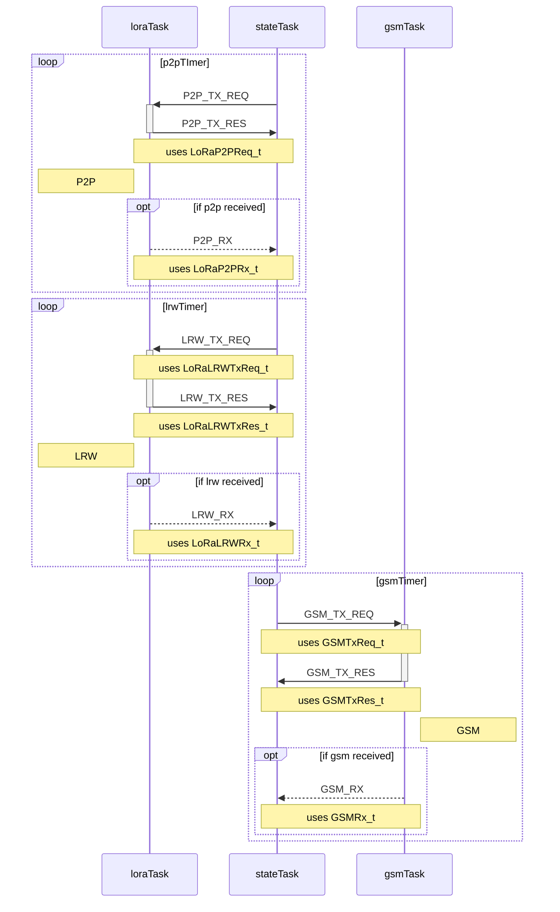
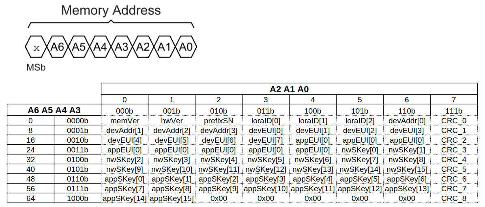

# fk-firmware-isca

- edit sdkconfig
    ```
    CONFIG_FREERTOS_HZ=1000
    ```
- run `idf.py  menuconfig` and enable ppp support
    ```
    Component config  / Enable PPP support
    ```
- flashing using esptool
    ```
    esptool.py --chip esp32 -p /dev/ttyUSB0 -b 460800 --before=default_reset --after=hard_reset write_flash --flash_mode dio --flash_freq 40m --flash_size 4MB 0x1000 bootloader/bootloader.bin 0x10000 fk-isca.bin 0x8000 partition_table/partition-table.bin 0xd000 ota_data_initial.bin
    ```

# Tasks intercommunication
- using the defaul event loop



## OTP Organization

- 9 pages of 8 bytes;
- the 8th byte [bit 7] of each page is a CRC;



- Example:
    ```
    Slave Address = 110b
        Standard Speed ACK
        Data Read = 0x01 0x00 0x6D 0xBE 0xBC 0x20 0x17 0x9C
        Data Read = 0x9F 0x2B 0xBA 0xD7 0x3F 0x71 0x26 0x18
        Data Read = 0xE8 0x77 0x6C 0xCE 0xBF 0x6E 0xAA 0xFB
        Data Read = 0x8F 0xCE 0x08 0xED 0xB9 0x02 0xE9 0x65
        Data Read = 0xBA 0xCE 0x93 0xD9 0x71 0x3C 0x4E 0x92
        Data Read = 0x17 0x41 0x93 0x55 0x49 0x95 0x97 0xBB
        Data Read = 0xD9 0x1B 0xC3 0x52 0x7F 0x9C 0xDB 0x3E
        Data Read = 0xBA 0x4F 0x32 0x5F 0x2E 0x62 0x38 0xCB
        Data Read = 0x0F 0xCF 0x00 0x00 0x00 0x00 0x00 0xF9
        [PARSE] memVer: 1 | hwVer: 0 | prefixSN: 109 
            loraID: 0xBE 0xBC 0x20 = 12500000
            devAddress: 0x17 0x9F 0x2B 0xBA
            devEUI: 0xD7 0x3F 0x71 0x26 0xE8 0x77 0x6C 0xCE
            appEUI: 0xBF 0x6E 0xAA 0x8F 0xCE 0x08 0xED 0xB9
            nwSKey: 0x02 0xE9 0xBA 0xCE 0x93 0xD9 0x71 0x3C 0x4E 0x17 0x41 0x93 0x55 0x49 0x95 0x97
            appSKey: 0xD9 0x1B 0xC3 0x52 0x7F 0x9C 0xDB 0xBA 0x4F 0x32 0x5F 0x2E 0x62 0x38 0x0F 0xCF
    ```

## GSM Packet